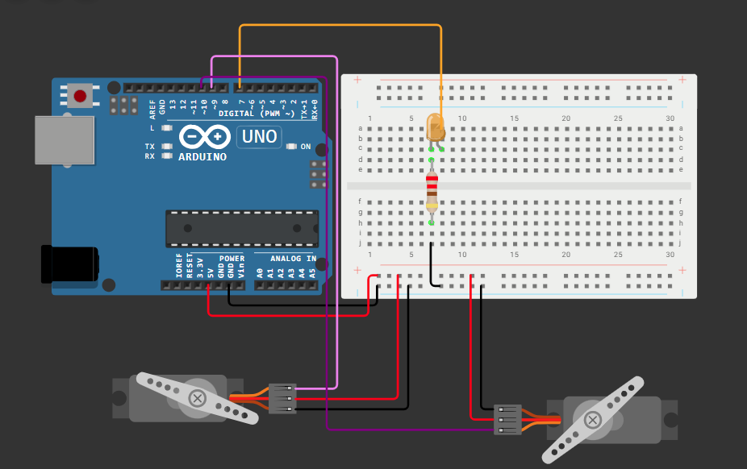
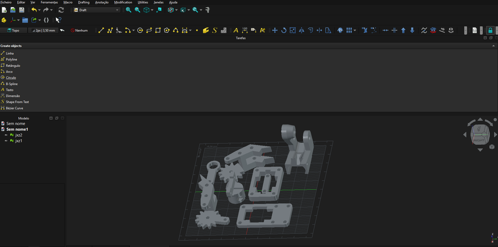
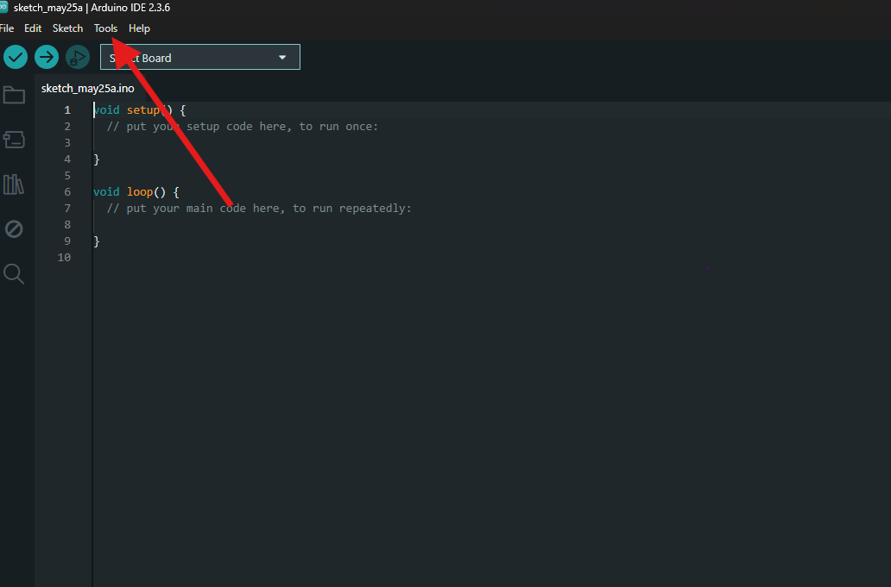
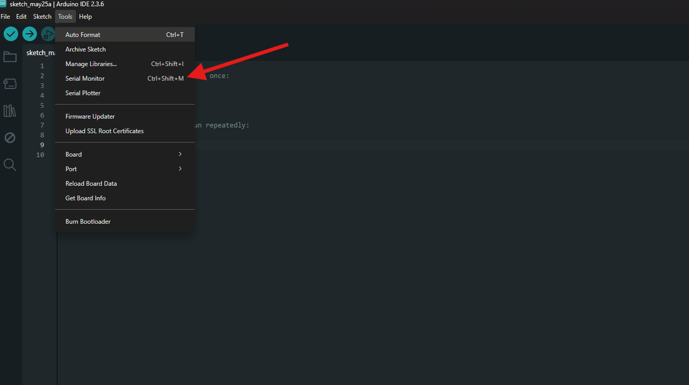
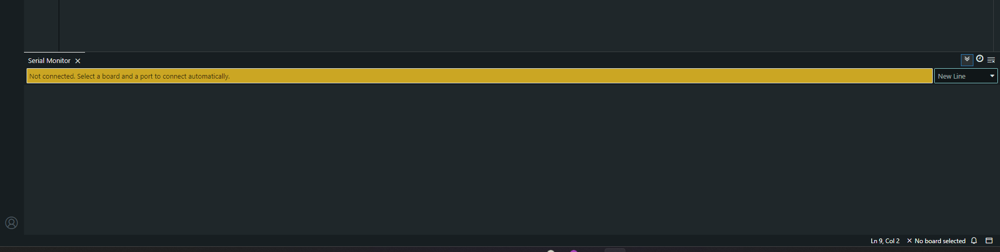

# Braço Robótico de Coleta (Docking & Retrieval)



Projeto desenvolvido com foco na manipulação de carga em ambientes de microgravidade, simulando um sistema de captura utilizado na indústria espacial. O controle é realizado via comandos no Monitor Serial, permitindo movimentação do braço e da garra.

---

## Identificação

**Integrantes:**

* Henrique Pontes Oliveira - RM98036
* Pedro Henrique Paladino - RM551180
* Gabriel Diegues Figueiredo Rocha - RM550788

---

## Acesso ao simulador

Acesse o projeto no Wokwi:
https://wokwi.com/projects/465032473980167169

---

## Guia de operação

Após iniciar a simulação, abra o **Serial Monitor** e utilize os seguintes comandos:

| Comando | Ação                    |
| ------- | ----------------------- |
| U       | Move o braço para cima  |
| D       | Move o braço para baixo |
| O       | Abre a garra            |
| C       | Fecha a garra           |

O sistema também fornece feedback visual através de um LED que pisca a cada comando executado.

---

## Software de Modelagem

O modelo 3D da garra foi desenvolvido utilizando o **FreeCad**, permitindo a criação de um design paramétrico e ajustável, compatível com servomotores de 9g. na tentativa de utilizar o OpenScad acabei escolhendo um parecido o qual conseguia mesclar entre o maya e o openscad ai achei o FreeCad

---

## Especificações técnicas

* **Placa:** Arduino Uno

* **Tensão de alimentação:** 5V

* **Componentes:**

  * 2x Servomotores SG90 (9g)
  * 1x LED
  * 1x Resistor 220Ω

* **Pinagem:**

  * Servo Base → Pino 9
  * Servo Garra → Pino 10
  * LED → Pino 7

* **Controle:** Monitor Serial (9600 baud)

---

## Descrição técnica

O sistema simula um braço robótico de captura utilizado em ambientes de microgravidade, onde o controle preciso e a estabilidade são fundamentais. A garra foi projetada com geometria curva para melhorar a aderência e evitar a perda de objetos durante a manipulação.

---

## Estrutura do repositório

```
/src       -> Código Arduino (.ino)
/model     -> Arquivos OpenSCAD (.scad) e STL
/images    -> Imagens do circuito e modelo 3D
README.md  -> Documentação do projeto
```

---

## Acessar serial monitor

Acredito que já possuem o Arduino IDE baixado, partindo deste ponto basta clicar em:
Ferramentas > Monitor Serial
ou com o atalho Ctrl+Shift+M



